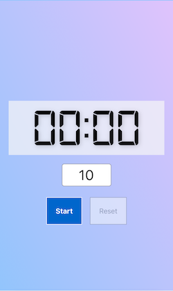

# Web Timer

A simple website timer to use when connected to a projector or via zoom.

Use the buttons or press the spacebar to start/pause the timer.

The default time is 10 minutes.

🌎 [View this on the web](https://sc137.github.io/web-timer/).

**Mobile**

**Desktop**

**Web-timer in Actions**

*/Sable*
